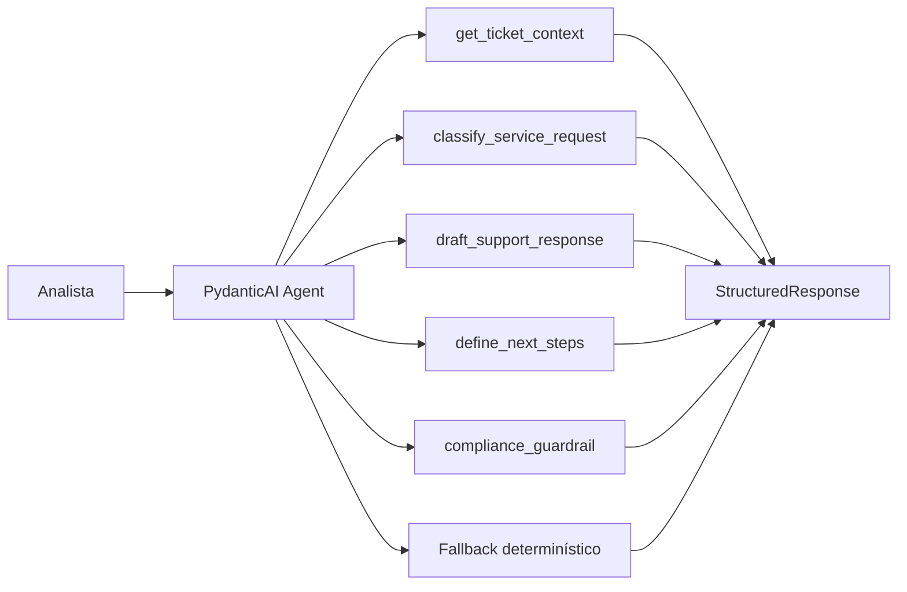

# Agente Atendimento

Um MVP de `PydanticAI` para atendimento inteligente com classificação, priorização, resposta customer-facing e próximos passos operacionais. O projeto foi desenhado para demonstrar um agente com contrato de saída fortemente tipado, tools de domínio e fallback determinístico para execução local.

## Visão Geral

O sistema responde perguntas como:

- qual time deve assumir o ticket?
- qual deve ser a prioridade operacional?
- como responder o cliente de forma clara e segura?
- quais são os próximos passos e o SLA sugerido?

## Arquitetura



## Topologia de Execução

O projeto foi estruturado em quatro camadas:

1. `ticket layer`
   - carrega o ticket consultado;
2. `service tools layer`
   - classifica categoria, prioridade, time, próximos passos e guardrails;
3. `agent orchestration layer`
   - usa `PydanticAI` com `output_type` estruturado quando o runtime está disponível;
4. `presentation layer`
   - expõe o fluxo via `CLI` e `Streamlit`.

## Estrutura do Projeto

- [src/sample_data.py](/Users/flaviagaia/Documents/CV_FLAVIA_CODEX/agente_atendimento/src/sample_data.py)
  - tickets demo.
- [src/tools.py](/Users/flaviagaia/Documents/CV_FLAVIA_CODEX/agente_atendimento/src/tools.py)
  - tools de classificação, resposta e próximos passos.
- [src/agent.py](/Users/flaviagaia/Documents/CV_FLAVIA_CODEX/agente_atendimento/src/agent.py)
  - orquestração com `PydanticAI` e fallback.
- [app.py](/Users/flaviagaia/Documents/CV_FLAVIA_CODEX/agente_atendimento/app.py)
  - console técnico em `Streamlit`.
- [main.py](/Users/flaviagaia/Documents/CV_FLAVIA_CODEX/agente_atendimento/main.py)
  - execução rápida e persistência do relatório.
- [tests/test_agent.py](/Users/flaviagaia/Documents/CV_FLAVIA_CODEX/agente_atendimento/tests/test_agent.py)
  - validação do fluxo principal.

## Como o PydanticAI foi modelado

O runtime planejado usa:

- `Agent`
  - agente principal do ecossistema `PydanticAI`;
- `deps_type`
  - contexto fortemente tipado com `ticket_id`;
- `output_type`
  - contrato de saída tipado com `SupportResponse`;
- tools registradas por `@agent.tool`.

### Modelo de saída

O agente retorna um `BaseModel` com:

- `ticket_id`
- `category`
- `priority`
- `recommended_team`
- `response_to_customer`
- `next_steps`
- `sla_bucket`
- `guardrail`

### Runtime modes

1. `pydantic_ai_agent`
   - usado quando há `OPENAI_API_KEY` e runtime `PydanticAI`;
2. `deterministic_fallback`
   - usado para execução local reprodutível.

## Tools de Atendimento

### `classify_service_request`
Classifica:

- categoria;
- prioridade;
- time recomendado;
- score heurístico de prioridade.

### `draft_support_response`
Produz uma resposta inicial grounded no ticket.

### `define_next_steps`
Organiza próximos passos operacionais e faixa de SLA.

### `compliance_guardrail`
Reforça linguagem segura e sem promessas indevidas.

## Modelo de Dados

Os tickets demo incluem:

- `ticket_id`
- `customer_name`
- `channel`
- `product_area`
- `subject`
- `message`
- `priority_hint`
- `sentiment`
- `customer_tier`
- `open_days`

## Exemplo de Ticket

```json
{
  "ticket_id": "SUP-1001",
  "customer_name": "Mariana Souza",
  "channel": "chat",
  "product_area": "billing",
  "subject": "Cobrança em duplicidade no cartão",
  "message": "Recebi duas cobranças no mesmo dia referentes à mesma assinatura e preciso entender como será o estorno.",
  "priority_hint": "alta",
  "sentiment": "frustrated",
  "customer_tier": "premium",
  "open_days": 1
}
```

## Contrato de Saída

`ask_support_agent()` retorna:

```json
{
  "runtime_mode": "pydantic_ai_agent | deterministic_fallback",
  "ticket": {},
  "structured_response": {
    "ticket_id": "SUP-1001",
    "category": "financeiro",
    "priority": "alta",
    "recommended_team": "billing_ops",
    "response_to_customer": "texto",
    "next_steps": ["..."],
    "sla_bucket": "24h",
    "guardrail": "texto"
  }
}
```

## Interface Streamlit

O app funciona como um `inspection console` para:

- selecionar o ticket;
- submeter uma pergunta operacional;
- inspecionar a resposta estruturada;
- comparar o ticket consultado com a decisão do agente.

## Execução Local

### Pipeline principal

```bash
python3 main.py
```

### Testes

```bash
python3 -m unittest discover -s tests -v
```

### Interface

```bash
streamlit run app.py
```

## Limitações

- base demo pequena;
- heurísticas simples de prioridade e roteamento;
- runtime real depende de `PydanticAI` e `OPENAI_API_KEY`;
- fallback determinístico para portabilidade local.

## English Version

`Agente Atendimento` is a `PydanticAI` MVP for intelligent customer support. The project combines structured service ticket context, domain tools for routing and next steps, and a typed agent output contract to produce reliable support responses. When the PydanticAI runtime is unavailable, a deterministic fallback preserves the same output shape for local reproducibility.

### Technical Highlights

- `Agent` with `deps_type` and `output_type`
- strongly typed `BaseModel` response contract
- tool-based routing, response drafting, and SLA suggestion
- deterministic fallback for local execution
- Streamlit inspection console
